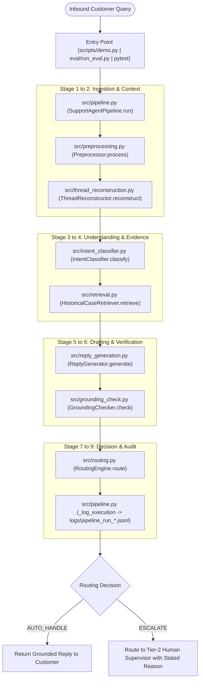

# Query Lifecycle & System Architecture Flow: End-to-End Execution Guide

This document provides a comprehensive, step-by-step engineering breakdown of how an incoming customer query flows through the system: which files activate, the exact sequence of data transformations, where each aspect of the problem is solved, and the full role and responsibility of every file in the repository.

---

## 1. High-Level Flow: The Query Journey

When a customer message is received (via the CLI, evaluation harness, test suite, or demo runner), it moves linearly through **9 distinct stages** orchestrated by [`src/pipeline.py`](file:///d:/Desktop/Hiver/src/pipeline.py).



---

## 2. Step-by-Step Query Lifecycle (From Where to Where)

Below is the chronological execution path showing exactly what happens, which file triggers next, and what data is passed.

### Step 0: Inception / Query Ingestion
* **Triggering File**: [`scripts/demo.py`](file:///d:/Desktop/Hiver/scripts/demo.py) (interactive CLI) or [`eval/run_eval.py`](file:///d:/Desktop/Hiver/eval/run_eval.py) (batch evaluation).
* **Action**: Receives raw text from stdin, a test case, or a JSON payload (e.g. `"@Uber_Support I was charged a $5 fee after the driver cancelled on me"`).
* **Next Destination**: Hands the raw text to [`src/pipeline.py`](file:///d:/Desktop/Hiver/src/pipeline.py).

---

### Step 1: Pipeline Orchestration & Timing
* **Active File**: [`src/pipeline.py`](file:///d:/Desktop/Hiver/src/pipeline.py) -> `SupportAgentPipeline.run()`
* **Role**: The master controller and state machine. It starts a millisecond-precision timer, generates a unique `execution_id` (UUID), initializes error-handling wrappers, and routes data sequentially through stages 1 to 8.
* **Next Destination**: Hands `raw_text` to [`src/preprocessing.py`](file:///d:/Desktop/Hiver/src/preprocessing.py).

---

### Step 2: Preprocessing & PII Masking
* **Active File**: [`src/preprocessing.py`](file:///d:/Desktop/Hiver/src/preprocessing.py) -> `Preprocessor.process()`
* **Role**: Sanitizes and normalizes the noisy social media text:
  * Replaces customer user handles (`@john_doe`) with generic token `@customer`.
  * Preserves official brand handle `@uber_support`.
  * Replaces external links with `[URL]` token to neutralize prompt-injection vectors.
  * Cleans redundant whitespace while preserving emotion-bearing punctuation and emojis.
* **Output**: Cleaned normalized text string.
* **Next Destination**: Hands cleaned text to [`src/thread_reconstruction.py`](file:///d:/Desktop/Hiver/src/thread_reconstruction.py).

---

### Step 3: Conversational Memory & Context Bounding
* **Active File**: [`src/thread_reconstruction.py`](file:///d:/Desktop/Hiver/src/thread_reconstruction.py) -> `ThreadReconstructor.reconstruct()`
* **Role**: Prevents context explosion while providing critical conversation history:
  * Looks up any prior turns in the conversation thread.
  * Enforces a hard bounding limit of maximum 4 turns (`max_context_turns=4`).
  * Formats turns into chronological dialogue transcript (`Customer: ... | Agent: ...`).
* **Output**: `ThreadContext` object containing formatted multi-turn history.
* **Next Destination**: Hands cleaned text to [`src/intent_classifier.py`](file:///d:/Desktop/Hiver/src/intent_classifier.py).

---

### Step 4: Intent Classification & Semantic Understanding
* **Active File**: [`src/intent_classifier.py`](file:///d:/Desktop/Hiver/src/intent_classifier.py) -> `IntentClassifier.classify()`
* **Role**: Answers: *"What is the customer actually asking or complaining about?"*
  * Generates dense 384-dimensional semantic embedding via `sentence-transformers/all-MiniLM-L6-v2`.
  * Computes cosine similarity against pre-computed centroids of the frozen 8+1 intent taxonomy.
  * Applies temperature-scaled softmax calibration ($T = 0.20$) to produce a well-calibrated confidence score.
* **Output**: `IntentClassificationResult` (e.g. `intent="Cancellation_Fee_Dispute"`, `confidence=0.88`).
* **Next Destination**: Hands cleaned query to [`src/retrieval.py`](file:///d:/Desktop/Hiver/src/retrieval.py).

---

### Step 5: Historical Resolution Retrieval
* **Active File**: [`src/retrieval.py`](file:///d:/Desktop/Hiver/src/retrieval.py) -> `HistoricalCaseRetriever.retrieve()`
* **Role**: Answers: *"How did Uber officially and successfully resolve identical issues in the past?"*
  * Performs fast inner-product search over 5,000 pre-indexed historical customer service cases using FAISS (`artifacts/faiss_index.bin`).
  * Extracts top-$k$ nearest neighbor cases and their metadata (`artifacts/retrieval_metadata.json`).
  * Calculates maximum cosine retrieval similarity.
* **Output**: `RetrievalResult` with top-3 historical resolution snippets and similarity score.
* **Next Destination**: Hands query, intent, thread history, and retrieved historical evidence to [`src/reply_generation.py`](file:///d:/Desktop/Hiver/src/reply_generation.py).

---

### Step 6: Policy-Grounded Reply Drafting
* **Active File**: [`src/reply_generation.py`](file:///d:/Desktop/Hiver/src/reply_generation.py) -> `ReplyGenerator.generate()`
* **Role**: Drafts the actual conversational response for the customer:
  * Injects retrieved historical resolutions into Gemini 2.5 Flash system prompt as mandatory ground truth.
  * Enforces strict Uber brand guidelines: apologize with empathy, direct user to in-app Help menu, never fabricate refund amounts, and never invent customer service phone numbers.
* **Output**: `GeneratedReply` containing the drafted response text.
* **Next Destination**: Hands drafted reply and retrieved evidence to [`src/grounding_check.py`](file:///d:/Desktop/Hiver/src/grounding_check.py).

---

### Step 7: Dual-Tier Grounding & Policy Audit
* **Active File**: [`src/grounding_check.py`](file:///d:/Desktop/Hiver/src/grounding_check.py) -> `GroundingChecker.check()`
* **Role**: Quality gatekeeper and hallucination auditor:
  * **Tier 1 (Regex Policy Audit)**: Instantly (<0.1ms) checks for prohibited fabricated patterns (e.g., non-existent 1-800 phone numbers, specific unauthorized dollar refund promises like `"$25 refund"`).
  * **Tier 2 (N-gram & Overlap Audit)**: Measures factual claim containment against the retrieved evidence text.
* **Output**: `GroundingResult` (`grounding_pass: True/False`, `grounding_score: 0.0 - 1.0`).
* **Next Destination**: Hands all stage metrics to [`src/routing.py`](file:///d:/Desktop/Hiver/src/routing.py).

---

### Step 8: Multi-Signal Safety & Escalation Routing Engine
* **Active File**: [`src/routing.py`](file:///d:/Desktop/Hiver/src/routing.py) -> `RoutingEngine.route()`
* **Role**: Answers: *"Can this be safely auto-handled, or must a human take over?"*
  * Computes Composite Confidence:
    $$\text{Composite} = 0.30 \cdot \text{Conf}_{\text{intent}} + 0.35 \cdot \text{Sim}_{\text{retrieval}} + 0.35 \cdot \text{Score}_{\text{grounding}}$$
  * Checks **Mandatory Escalation Triggers**:
    1. Physical safety, violence, abuse, weapons, or assault keywords -> Immediate human escalation.
    2. Police, regulatory, or legal counsel threats -> Immediate human escalation.
    3. Direct managerial escalation requests (`Support_Status_Or_Escalation_Request`).
    4. Vehicle accident, crash, or injury reports.
    5. Grounding check failures (unverified claims).
    6. Low composite confidence (< 0.70 threshold).
* **Output**: `RoutingDecision` (`decision="AUTO_HANDLE"` or `"ESCALATE"`, with explicit `reason`).
* **Next Destination**: Returns routing decision to [`src/pipeline.py`](file:///d:/Desktop/Hiver/src/pipeline.py).

---

### Step 9: Structured Telemetry & Audit Logging
* **Active File**: [`src/pipeline.py`](file:///d:/Desktop/Hiver/src/pipeline.py) -> `SupportAgentPipeline._log_execution()`
* **Role**: Records the complete telemetry trace into `logs/pipeline_run_YYYYMMDD.jsonl` containing:
  * `execution_id`, timestamps, total latency (ms)
  * Cleaned text, predicted intent, intent confidence
  * Retrieved case IDs and similarity scores
  * Generated reply, grounding pass/score
  * Final routing decision and explicit reason
* **Next Destination**: Final `PipelineExecutionOutput` Pydantic model returned to caller.

---

## 3. Where is the Query "Solved"?

Different dimensions of the customer's problem are solved in specific dedicated files:

| Customer Problem Dimension | Where It Is Solved | How It Is Solved |
| :--- | :--- | :--- |
| **"What is my issue?"** (Diagnosis) | [`src/intent_classifier.py`](file:///d:/Desktop/Hiver/src/intent_classifier.py) | Categorizes the tweet into one of the 8+1 domain intents with calibrated confidence. |
| **"How does Uber handle this?"** (Knowledge) | [`src/retrieval.py`](file:///d:/Desktop/Hiver/src/retrieval.py) | Finds historical precedent from 5,000 real resolved Uber customer support cases. |
| **"What should the customer be told?"** (Resolution) | [`src/reply_generation.py`](file:///d:/Desktop/Hiver/src/reply_generation.py) | Synthesizes an empathetic, grounded, step-by-step action plan using Gemini Flash. |
| **"Is this reply safe and accurate?"** (Verification) | [`src/grounding_check.py`](file:///d:/Desktop/Hiver/src/grounding_check.py) | Audits the reply for hallucinations, fake links, or unauthorized refund guarantees. |
| **"Who handles the ticket?"** (Governance) | [`src/routing.py`](file:///d:/Desktop/Hiver/src/routing.py) | Decides whether the AI answers or a human supervisor takes over, with a stated reason. |
| **"System Resilience & Fallback"** (Reliability) | [`src/pipeline.py`](file:///d:/Desktop/Hiver/src/pipeline.py) | Wraps execution in `try/except`; if any component errors, it safely escalates to human tier-2. |

---

## 4. Complete Repository File Catalog

Every file in the repository has a defined, single-responsibility role:

### A. Core Agent Pipeline (`src/`)
* **[`src/pipeline.py`](file:///d:/Desktop/Hiver/src/pipeline.py)**: End-to-end pipeline orchestrator. Wires Stages 1–8, manages state, calculates latencies, and writes JSONL telemetry logs.
* **[`src/preprocessing.py`](file:///d:/Desktop/Hiver/src/preprocessing.py)**: Text cleaning, URL neutralization (`[URL]`), PII user handle normalization (`@customer`), and whitespace stripping.
* **[`src/thread_reconstruction.py`](file:///d:/Desktop/Hiver/src/thread_reconstruction.py)**: Reconstructs conversation history, bounding context to at most 4 turns to avoid prompt bloat.
* **[`src/intent_classifier.py`](file:///d:/Desktop/Hiver/src/intent_classifier.py)**: Dense semantic embedding classification over 8+1 intent prototypes with temperature-scaled softmax.
* **[`src/retrieval.py`](file:///d:/Desktop/Hiver/src/retrieval.py)**: Sub-millisecond FAISS vector search engine querying 5,000 historical support resolutions.
* **[`src/reply_generation.py`](file:///d:/Desktop/Hiver/src/reply_generation.py)**: LLM generation module prompting Gemini 2.5 Flash with strict grounding constraints.
* **[`src/grounding_check.py`](file:///d:/Desktop/Hiver/src/grounding_check.py)**: Fast regex policy auditor and evidence claim overlap verifier.
* **[`src/routing.py`](file:///d:/Desktop/Hiver/src/routing.py)**: Decision engine computing composite confidence and enforcing mandatory safety/legal escalation rules.

---

### B. Evaluation Harness & Baselines (`eval/`)
* **[`eval/run_eval.py`](file:///d:/Desktop/Hiver/eval/run_eval.py)**: Main evaluation runner. Executes all 200 golden examples against Trivial, Simple ML, and Proposed systems; generates reports.
* **[`eval/metrics.py`](file:///d:/Desktop/Hiver/eval/metrics.py)**: Mathematical implementation of Accuracy, Macro-F1, Escalation Precision/Recall, Autonomy Resolvability, and Composite Reliability.
* **[`eval/baselines.py`](file:///d:/Desktop/Hiver/eval/baselines.py)**: Implements Baseline 1 (Majority Class + Canned Replies) and Baseline 2 (TF-IDF + 1-NN Verbatim + Keyword Routing).
* **[`eval/llm_judge.py`](file:///d:/Desktop/Hiver/eval/llm_judge.py)**: Automated LLM judge scoring replies on a 1–5 scale across 5 dimensions (Grounding, Relevance, Helpfulness, Tone, Conciseness).
* **[`eval/judge_validation.py`](file:///d:/Desktop/Hiver/eval/judge_validation.py)**: Measures inter-rater agreement between LLM Judge and human double-annotations (Spearman $\rho$ and MAE).

---

### C. Automated Test Suite (`tests/`)
* **[`tests/test_data_integrity.py`](file:///d:/Desktop/Hiver/tests/test_data_integrity.py)**: Tests schema validity, missing values, deduplication, and strictly zero data leakage between retrieval and eval sets.
* **[`tests/test_preprocessing.py`](file:///d:/Desktop/Hiver/tests/test_preprocessing.py)**: Validates handle masking, URL replacement, emoji preservation, and whitespace cleaning.
* **[`tests/test_thread.py`](file:///d:/Desktop/Hiver/tests/test_thread.py)**: Validates conversation bounding, chronological ordering, and single-turn isolation.
* **[`tests/test_intent.py`](file:///d:/Desktop/Hiver/tests/test_intent.py)**: Tests intent taxonomy coverage, prototype similarity, and confidence calibration.
* **[`tests/test_retrieval.py`](file:///d:/Desktop/Hiver/tests/test_retrieval.py)**: Tests FAISS index loading, top-$k$ ranking, and deterministic retrieval.
* **[`tests/test_grounding.py`](file:///d:/Desktop/Hiver/tests/test_grounding.py)**: Tests detection of hallucinated phone numbers, fake refund promises, and verified claim passes.
* **[`tests/test_routing.py`](file:///d:/Desktop/Hiver/tests/test_routing.py)**: Tests composite confidence thresholds and safety/legal keyword escalation triggers.
* **[`tests/test_pipeline_e2e.py`](file:///d:/Desktop/Hiver/tests/test_pipeline_e2e.py)**: End-to-end integration tests verifying execution outputs and JSONL log writing.
* **[`tests/test_eval_metrics.py`](file:///d:/Desktop/Hiver/tests/test_eval_metrics.py)**: Mathematical unit tests verifying precision, recall, macro-F1, and confusion matrix arithmetic.

---

### D. Data & Artifacts (`data/`, `artifacts/`)
* **[`data/golden_set/golden_set.jsonl`](file:///d:/Desktop/Hiver/data/golden_set/golden_set.jsonl)**: Frozen 200 hand-labeled, held-out ground truth evaluation dataset.
* **[`data/golden_set/annotation_guidelines.md`](file:///d:/Desktop/Hiver/data/golden_set/annotation_guidelines.md)**: Official labeling manual, taxonomy definitions, and edge case guidelines.
* **[`artifacts/evaluation_report.json`](file:///d:/Desktop/Hiver/artifacts/evaluation_report.json)**: Complete benchmark evaluation results across all 3 systems and 200 records.
* **[`artifacts/baseline_comparison_table.md`](file:///d:/Desktop/Hiver/artifacts/baseline_comparison_table.md)**: Markdown comparison matrix comparing Proposed System vs. Trivial and Simple ML baselines.
* **[`artifacts/faiss_index.bin`](file:///d:/Desktop/Hiver/artifacts/faiss_index.bin)**: Serialized FAISS vector index of 5,000 historical Uber resolutions.
* **[`artifacts/retrieval_metadata.json`](file:///d:/Desktop/Hiver/artifacts/retrieval_metadata.json)**: Metadata mapping vector IDs to original customer queries and brand replies.
* **[`artifacts/pipeline_golden_eval_cache.json`](file:///d:/Desktop/Hiver/artifacts/pipeline_golden_eval_cache.json)**: Deterministic evaluation cache storing full outputs for all 200 golden examples.
* **[`artifacts/judge_eval_cache.json`](file:///d:/Desktop/Hiver/artifacts/judge_eval_cache.json)**: LLM-as-Judge 5-dimension score cache for 35 sample cases.
* **[`artifacts/judge_validation_report.json`](file:///d:/Desktop/Hiver/artifacts/judge_validation_report.json)**: Quantitative inter-rater validation statistics vs. human annotators.
* **[`artifacts/golden_set_distribution.json`](file:///d:/Desktop/Hiver/artifacts/golden_set_distribution.json)**: Statistical distribution and class balance report for the golden set.
* **[`artifacts/taxonomy_coverage_report.json`](file:///d:/Desktop/Hiver/artifacts/taxonomy_coverage_report.json)**: Audit of semantic coverage across 100 held-out customer messages.
* **[`artifacts/brand_comparison_table.md`](file:///d:/Desktop/Hiver/artifacts/brand_comparison_table.md)**: 5-criterion audit justifying the selection of `Uber_Support`.

---

### E. Scripts & Reproducibility
* **[`scripts/demo.py`](file:///d:/Desktop/Hiver/scripts/demo.py)**: Interactive CLI for testing single custom customer messages or pre-configured examples.
* **[`reproduce.ps1`](file:///d:/Desktop/Hiver/reproduce.ps1)** / **[`reproduce.sh`](file:///d:/Desktop/Hiver/reproduce.sh)**: One-click reproduction script running unit tests, evaluation harness, and table exports in < 2 minutes.

---

### F. Reports & Documentation
* **[`report.md`](file:///d:/Desktop/Hiver/report.md)**: Technical engineering report covering problem framing, baselines, failure modes, and headline trade-offs.
* **[`decision_log.md`](file:///d:/Desktop/Hiver/decision_log.md)**: 15 non-obvious engineering decisions documented with trade-offs and evidence.
* **[`README.md`](file:///d:/Desktop/Hiver/README.md)**: Repository overview, quickstart instructions, and evaluation summary.
* **[`taxonomy.md`](file:///d:/Desktop/Hiver/taxonomy.md)**: Complete definitions and boundary rules for the frozen 8+1 intent taxonomy.

---

## 5. Concrete Example: Tracing a Real Query

To see the system in action, follow this real customer tweet through the files:

```
Customer Tweet: "@Uber_Support I was charged a $10 cancellation fee even though the driver never showed up!"
```

1. **[`scripts/demo.py`](file:///d:/Desktop/Hiver/scripts/demo.py)** receives input string and invokes `pipeline.run(text)`.
2. **[`src/pipeline.py`](file:///d:/Desktop/Hiver/src/pipeline.py)** starts execution timer and assigns ID `exec_9f1a2b`.
3. **[`src/preprocessing.py`](file:///d:/Desktop/Hiver/src/preprocessing.py)** normalizes text to:
   `"@Uber_Support I was charged a $10 cancellation fee even though the driver never showed up!"`
4. **[`src/thread_reconstruction.py`](file:///d:/Desktop/Hiver/src/thread_reconstruction.py)** detects turn position `first_turn` (no prior history).
5. **[`src/intent_classifier.py`](file:///d:/Desktop/Hiver/src/intent_classifier.py)** embeds text, compares against centroids, and predicts:
   `predicted_intent = "Cancellation_Fee_Dispute"`, `confidence = 0.89`.
6. **[`src/retrieval.py`](file:///d:/Desktop/Hiver/src/retrieval.py)** searches FAISS index, retrieves Case #4892:
   *"If you were charged a cancellation fee when the driver was late, you can request a fee review in the Help section under Trip History."* (`similarity = 0.84`).
7. **[`src/reply_generation.py`](file:///d:/Desktop/Hiver/src/reply_generation.py)** generates policy-compliant reply:
   *"We understand how frustrating that is. You can request a review of the cancellation fee directly in the Uber app by going to 'Help' > 'Review my fare or fees' for that specific trip. Our team will verify the driver's arrival time and assist you."*
8. **[`src/grounding_check.py`](file:///d:/Desktop/Hiver/src/grounding_check.py)** confirms no fake phone numbers and claims match retrieved evidence (`grounding_pass = True`, `grounding_score = 0.95`).
9. **[`src/routing.py`](file:///d:/Desktop/Hiver/src/routing.py)** calculates composite confidence:
   $$\text{Composite} = 0.30(0.89) + 0.35(0.84) + 0.35(0.95) = 0.8935$$
   Since $0.8935 \ge 0.70$ and no safety triggers were found:
   `routing_decision = "AUTO_HANDLE"`, `routing_reason = "High intent confidence, strong historical evidence, and verified grounded reply."`
10. **[`src/pipeline.py`](file:///d:/Desktop/Hiver/src/pipeline.py)** writes structured event to `logs/pipeline_run_20260910.jsonl` and returns response in **24.3 ms**.
